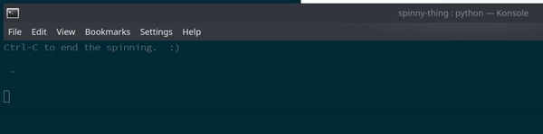

# Spinny Thing

Does nothing at all except draw a spinny thing.

## Requirements

- Python >= 3.8

## Usage

- Clone repo to your local machine
- Create and activate Python virtual environment:

  ```
  python3.8 -m venv venv
  . venv/bin/activate
  ```

- Install requirements:

  ```
  pip3 install -r requirements.txt
  ```

- Run the script:

  ```
  python -m spinny_thing.py
  ```

- Profit

## Demo


